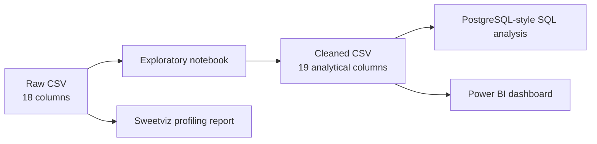

# Customer Shopping Behaviour Analysis

> A practical retail analytics project that turns 3,900 customer purchase records into a cleaned analysis dataset, SQL business questions, an exploratory profile, and a Power BI dashboard.

## Executive Summary

This project examines customer demographics, product demand, purchasing frequency, discounts, reviews, shipping, loyalty, and subscriptions. The analysis is designed to help a retail team answer a simple question: **where should merchandising, retention, and promotion effort be focused?**

### Headline signals

| Signal | Observation | Business reading |
| --- | ---: | --- |
| Recorded purchase value | **$233,081** across 3,900 records | A useful baseline for comparing segments and categories |
| Average purchase amount | **$59.76** | A practical benchmark for high-value customer and promotion analysis |
| Customer mix | **2,652 male (68%)**, 1,248 female (32%) | Current demand is male-skewed; growth plans should test whether this reflects the market or acquisition mix |
| Category mix | **Clothing: 1,737 purchases (45%)** | Clothing is the volume anchor and deserves the strongest availability and assortment attention |
| Subscriber base | **1,053 subscribers (27%)** | Subscription is a meaningful but minority behavior; conversion and retention deserve separate analysis |
| Ratings quality | **37 missing ratings** in the raw data | Category-level median imputation keeps the analysis usable, but rating-based decisions should be treated cautiously |

These are descriptive findings from the supplied data, not causal claims. They describe this sample and should be validated against margin, customer-level history, inventory, and campaign data before commercial decisions are made.

## Business Insights

### 1. Protect the volume engine, then improve its value

Clothing represents nearly half of all purchases, followed by accessories at 32%. This makes clothing the clearest place to protect availability, reduce stock-outs, and test cross-sell journeys into accessories. Volume alone does not prove profitability, so the next useful cut is category revenue and margin rather than order count only.

### 2. Treat customer mix as a growth question

The dataset is 68% male and 32% female. This can indicate strong product-market fit with male shoppers, an acquisition-channel effect, or an underdeveloped female assortment. Marketing and merchandising teams should compare conversion, average spend, repeat behavior, and subscription adoption by gender before deciding whether to optimize the existing mix or broaden it.

### 3. Build a promotion strategy around incremental value

The raw file contains both `Discount Applied` and `Promo Code Used`, and they match in every row. The cleaned file removes the duplicate field to avoid double-counting the same signal. The SQL analysis identifies customers who used a discount while spending at least the overall average and ranks products by discount rate. The commercial test is whether discounts create incremental revenue or simply subsidize purchases that would have happened anyway.

### 4. Make loyalty measurable at customer level

The project segments rows using `Previous Purchases` into New, Returning, and Loyal groups, and separately examines repeat buyers with more than five previous purchases. This is a useful first segmentation, but the available file appears to contain one record per customer rather than a transaction history. A production loyalty program should use customer-level order counts, recency, frequency, monetary value, and churn signals across multiple orders.

### 5. Use subscriptions as a retention lever, not just a label

Only 1,053 of 3,900 records are marked as subscribed. The SQL file compares subscriber and non-subscriber average spend and total revenue, and checks subscription status among repeat buyers. The next decision is not simply whether subscribers spend more: it is whether subscription drives repeat purchasing, improves retention, and remains profitable after benefits and discounts.

### 6. Ratings are helpful directionally, with a data-quality caveat

The raw data has 37 missing review ratings. The notebook fills these values with the median rating for the corresponding category, which preserves row completeness while avoiding a single global assumption. Imputed ratings should not be used as if they were genuine customer feedback; report observed and imputed ratings separately for product-quality decisions.

## Project Flow



## File Guide

| File | Purpose |
| --- | --- |
| [customer_shopping_behavior.csv](customer_shopping_behavior.csv) | Raw source data: 3,900 rows and 18 columns, including original display-style column names and `Promo Code Used`. |
| [Customer_Shopping_Behaviour_exploratoryAnalysis.ipynb](Customer_Shopping_Behaviour_exploratoryAnalysis.ipynb) | Python workflow for profiling, missing-value treatment, column normalization, feature engineering, and CSV export. |
| [customer_shopping_behaviour_cleaned.csv](customer_shopping_behaviour_cleaned.csv) | Analysis-ready output: 3,900 rows and 19 columns. It contains normalized names, imputed ratings, `age_group`, and `purchase_frequency_days`. |
| [customer_shopping_behaviour.sql](customer_shopping_behaviour.sql) | Ten SQL business questions covering revenue, discounts, products, shipping, subscriptions, loyalty, and age groups. |
| [exploratory_data_analysis_using_sweetviz.html](exploratory_data_analysis_using_sweetviz.html) | Standalone Sweetviz 2.3.3 profile of the raw dataset: distributions, missingness, associations, and correlations. |
| [customer_shopping_behavior_dashboard.pbix](customer_shopping_behavior_dashboard.pbix) | Power BI dashboard package for interactive reporting. Open it with Power BI Desktop. |

## Data Preparation

The notebook performs the following transformations:

1. Loads and profiles the raw CSV with pandas.
2. Checks missing values and fills missing `Review Rating` values with the median for their category.
3. Converts column names to lowercase snake case and renames `purchase_amount_(usd)` to `purchase_amount`.
4. Creates quartile-based `age_group` values: `young_adult`, `adult`, `middle_aged`, and `senior`.
5. Maps purchase-frequency labels to approximate days: weekly = 7, fortnightly/bi-weekly = 14, monthly = 30, quarterly/every 3 months = 90, and annually = 365.
6. Verifies that `Discount Applied` and `Promo Code Used` match, then removes the redundant promo column from the cleaned output.
7. Exports `customer_shopping_behaviour_cleaned.csv`.

### Raw versus cleaned schema

The cleaned file is not a drop-in rename of the raw file. It has **19 columns** because it removes the redundant `promo_code_used` field and adds two derived fields:

- `age_group`
- `purchase_frequency_days`

The cleaned file also uses analysis-friendly names such as `customer_id`, `item_purchased`, and `purchase_amount`.

## SQL Analysis Catalog

The SQL script answers these business questions:

1. Revenue by gender
2. Above-average spenders who used a discount
3. Top five products by average review rating
4. Average spend for Standard versus Express shipping
5. Subscriber versus non-subscriber spend and revenue
6. Products with the highest discount-purchase rate
7. New, Returning, and Loyal customer segments
8. Top three products within each category
9. Subscription status among repeat buyers
10. Revenue contribution by age group

### SQL readiness notes

- **Q10 needs a small repair before execution:** the `FROM` clause is missing `customer_shopping_behaviour_cleaned`.
- **Q7 is a row-level approximation:** it labels each record using its `previous_purchases` value; it does not aggregate a multi-order customer history.
- **Q8 uses `ROW_NUMBER()`:** tied products can be excluded. Use `DENSE_RANK()` when ties should all be retained.
- The queries use PostgreSQL syntax such as `::numeric`; adapt the cast and identifier syntax if running them in another database engine.

## How To Use

### Python and notebook

Install the notebook dependencies in a Python environment:

```bash
pip install pandas numpy matplotlib scipy sweetviz sqlalchemy psycopg2-binary
```

Open the notebook in Jupyter or VS Code and run the cells in order. The current notebook uses an absolute raw-file path (`/customer_shopping_behavior.csv`); when running locally, update it to a workspace-relative path such as:

```python
df = pd.read_csv("customer_shopping_behavior.csv")
```

### SQL

Load `customer_shopping_behaviour_cleaned.csv` into a table named `customer_shopping_behaviour_cleaned`, then run the queries in [customer_shopping_behaviour.sql](customer_shopping_behaviour.sql). Fix Q10 before running the full script:

```sql
FROM customer_shopping_behaviour_cleaned
```

### Reports

- Open [exploratory_data_analysis_using_sweetviz.html](exploratory_data_analysis_using_sweetviz.html) directly in a browser for the static exploratory report.
- Open [customer_shopping_behavior_dashboard.pbix](customer_shopping_behavior_dashboard.pbix) in Power BI Desktop for the interactive dashboard.

## Data Quality and Scope

- The raw and cleaned files both contain 3,900 rows.
- The raw dataset contains 37 missing review ratings and no duplicate rows according to the Sweetviz report.
- `age_group` is quartile-based, so its boundaries depend on this dataset and may shift when new data is added.
- Frequency labels are mapped to approximate day counts; these are analytical estimates, not observed intervals.
- The dataset supports descriptive analysis. It does not by itself establish campaign lift, causal discount impact, customer lifetime value, profitability, or retention over time.
- For a stronger next version, add order timestamps, order identifiers, product cost/margin, inventory, campaign exposure, and multiple transactions per customer.

## Recommended Next Analyses

1. Compare category revenue, margin, discount rate, and rating together to find profitable assortment opportunities.
2. Measure subscriber conversion and renewal by acquisition source, purchase frequency, and loyalty segment.
3. Separate observed from imputed ratings in the dashboard.
4. Replace row-level loyalty labels with a customer transaction table and RFM segmentation.
5. Run controlled promotion tests to estimate incremental revenue and margin impact.
