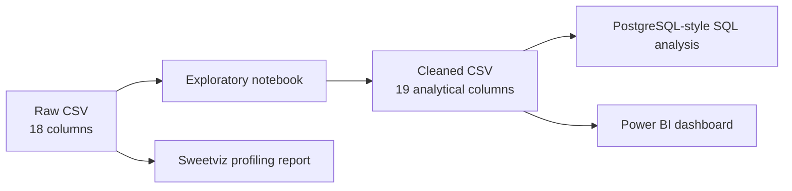
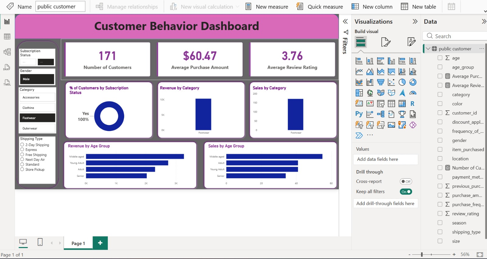

# Customer Shopping Behaviour Analysis

> A practical retail analytics project that turns 3,900 customer purchase records into a cleaned analysis dataset, SQL business questions, an exploratory profile, and a Power BI dashboard.

## Executive Summary

This project is a descriptive retail analytics study of customer demographics, product demand, purchase frequency, discounts, reviews, shipping, loyalty, and subscriptions. It combines Python-based data preparation, Sweetviz profiling, PostgreSQL-style SQL analysis, and a Power BI dashboard to move from raw customer records to an interpretable business view.

The dataset contains **3,900 records**, **18 raw fields**, and **$233,081** in recorded purchase value. The analysis shows a concentrated clothing-led product mix, a male-skewed customer base, broadly similar basket values across most segments, and measurable but modest differences associated with discounts, subscriptions, seasons, and shipping methods.

### Headline signals

| Signal | Observation | Business reading |
| --- | ---: | --- |
| Recorded purchase value | **$233,081** across 3,900 records | The financial baseline used throughout the segment analysis |
| Average purchase amount | **$59.76** | Purchase values are tightly centered around a consistent mid-market basket |
| Customer mix | **2,652 male (68%)**, 1,248 female (32%) | The observed customer base is materially male-skewed |
| Category mix | **Clothing: 1,737 purchases (44.5%)** | Clothing contributes 44.7% of recorded revenue and is the largest demand pool |
| Subscriber base | **1,053 subscribers (27%)** | Subscription participation is meaningful, but most records are non-subscribed |
| Data completeness | **37 missing ratings (0.9%)** | The only material missing-value issue identified in the raw profile |

These are descriptive findings from the supplied data. They show association and distribution, not causal impact, profitability, customer lifetime value, or retention over time.

## Business Findings

### 1. Clothing is the core revenue contributor

Clothing accounts for **1,737 records (44.5%)** and **$104,264 (44.7%)** of recorded purchase value. Accessories follow with **1,240 records (31.8%)** and **$74,200 (31.8%)**. Footwear contributes 15.5% of revenue, while outerwear contributes 7.9%. The close alignment between purchase share and revenue share indicates that category mix, rather than large differences in basket value, is the main driver of revenue concentration.

### 2. Female customers have a slightly higher average purchase value

Male customers generate **$157,890 (67.7%)** from 2,652 records, with an average purchase value of **$59.54**. Female customers generate **$75,191 (32.3%)** from 1,248 records, with an average of **$60.25**. The female average is approximately **$0.71 higher**, but the male revenue lead is explained primarily by the larger number of male records, not a higher male basket value.

### 3. Discounted purchases have a modestly lower basket value

There are **1,677 discounted records (43.0%)** and 2,223 non-discounted records (57.0%). Discounted records average **$59.28**, compared with **$60.13** for non-discounted records, a difference of **$0.85**. Discounted purchases contribute 42.7% of recorded revenue, slightly below their 43.0% volume share. This is an observed association only; the data does not show whether discounts lowered basket value or were targeted at already smaller purchases.

### 4. Subscription status is not associated with higher average purchase value in this sample

Subscribers represent **1,053 records (27.0%)**, generate **$62,645 (26.9%)**, and average **$59.49** per purchase. Non-subscribers represent 2,847 records, generate **$170,436 (73.1%)**, and average **$59.87**. The **$0.38 lower** subscriber average means subscription status is not a higher-spend indicator in this dataset. Because the file does not provide subscription start dates, renewals, or repeated orders, it cannot establish whether subscription improves retention.

### 5. Seasonal differences are visible but limited

Fall has the highest average purchase value at **$61.56**, followed by Winter at **$60.36**, Spring at **$58.74**, and Summer at **$58.41**. Fall contributes **$60,018 (25.7%)** of revenue from 975 records. The seasonal revenue distribution is relatively balanced, so the difference is more meaningful as a basket-value pattern than as evidence of strong seasonal revenue concentration.

### 6. Shipping method shows only moderate basket differences

Average purchase value ranges from **$58.46 for Standard** shipping to **$60.73 for 2-Day Shipping**. Express averages **$60.48**, Free Shipping **$60.41**, Store Pickup **$59.89**, and Next Day Air **$58.63**. The $2.27 spread between the highest and lowest methods is small relative to the overall $59.76 average, and no shipping method can be judged profitable without shipping-cost data.

### 7. The data supports demand analysis more strongly than customer-lifecycle analysis

The `Previous Purchases` field supports the SQL script's New, Returning, and Loyal labels, but the dataset does not contain order dates or a multi-order transaction table. These labels should therefore be read as segments of records by reported prior-purchase count, not as a measured customer journey. The same limitation applies to subscription retention and repeat-buyer behavior.

### 8. Review analysis requires transparent treatment of missing values

The raw dataset has **37 missing `Review Rating` values**. The notebook fills them with the median rating of the corresponding category, retaining all 3,900 records while avoiding a single global imputation value. This is reasonable for exploratory completeness, but imputed ratings are not observed customer feedback and should be distinguished in any quality-focused interpretation.

## Project Flow



## Dashboard Preview

The Power BI dashboard presents the same findings as an interactive reporting layer, with KPI cards and visual breakdowns by subscription status, category, age group, season, and customer attributes.



View the [full-resolution dashboard preview](customer_behaviour_dashboard.jpeg) or open the [Power BI dashboard file](customer_shopping_behavior_dashboard.pbix) in Power BI Desktop.

## How The Analysis Was Built

The work follows a reproducible four-stage process:

1. **Profile the source:** The raw CSV was loaded with pandas and inspected using structure, descriptive statistics, missing-value checks, and Sweetviz profiling. This established the 3,900-row, 18-field starting point and identified the missing review ratings.
2. **Prepare analytical fields:** Rating gaps were filled using category medians, column names were standardized to snake case, and `age_group` and `purchase_frequency_days` were derived for segmentation and reporting.
3. **Validate the transformation:** `Discount Applied` was compared with `Promo Code Used`; all records matched, confirming that the promo field duplicated the discount indicator. The redundant field was removed from the cleaned output, and the cleaned file was exported with 19 columns.
4. **Analyze and communicate:** SQL queries were written around revenue, product, discount, shipping, subscription, loyalty, and age-group questions. The resulting measures are presented in the Power BI dashboard and supported by the static Sweetviz report.

This approach separates **data preparation**, **descriptive analysis**, and **business interpretation**, making it possible to trace each headline finding back to the source data or a documented transformation.

## File Guide

| File | Purpose |
| --- | --- |
| [customer_shopping_behavior.csv](customer_shopping_behavior.csv) | Raw source data: 3,900 rows and 18 columns, including original display-style column names and `Promo Code Used`. |
| [Customer_Shopping_Behaviour_exploratoryAnalysis.ipynb](Customer_Shopping_Behaviour_exploratoryAnalysis.ipynb) | Python workflow for profiling, missing-value treatment, column normalization, feature engineering, and CSV export. |
| [customer_shopping_behaviour_cleaned.csv](customer_shopping_behaviour_cleaned.csv) | Analysis-ready output: 3,900 rows and 19 columns. It contains normalized names, imputed ratings, `age_group`, and `purchase_frequency_days`. |
| [customer_shopping_behaviour.sql](customer_shopping_behaviour.sql) | Ten SQL business questions covering revenue, discounts, products, shipping, subscriptions, loyalty, and age groups. |
| [exploratory_data_analysis_using_sweetviz.html](exploratory_data_analysis_using_sweetviz.html) | Standalone Sweetviz 2.3.3 profile of the raw dataset: distributions, missingness, associations, and correlations. |
| [customer_shopping_behavior_dashboard.pbix](customer_shopping_behavior_dashboard.pbix) | Power BI dashboard package for interactive reporting. Open it with Power BI Desktop. |
| [customer_behaviour_dashboard.jpeg](customer_behaviour_dashboard.jpeg) | Static dashboard image showing the report layout, KPIs, filters, and primary visual findings. |
| `.DS_Store` | macOS Finder metadata; not part of the analysis. It can be excluded from version control. |

## Data Preparation

The notebook performs the following transformations:

1. Loads and profiles the raw CSV with pandas.
2. Checks missing values and fills missing `Review Rating` values with the median for their category.
3. Converts column names to lowercase snake case and renames `purchase_amount_(usd)` to `purchase_amount`.
4. Creates quartile-based `age_group` values: `young_adult`, `adult`, `middle_aged`, and `senior`.
5. Maps purchase-frequency labels to approximate days: weekly = 7, fortnightly/bi-weekly = 14, monthly = 30, quarterly/every 3 months = 90, and annually = 365.
6. Verifies that `Discount Applied` and `Promo Code Used` match, then removes the redundant promo column from the cleaned output.
7. Exports `customer_shopping_behaviour_cleaned.csv`.

### Raw versus cleaned schema

The cleaned file is not a drop-in rename of the raw file. It has **19 columns** because it removes the redundant `promo_code_used` field and adds two derived fields:

- `age_group`
- `purchase_frequency_days`

The cleaned file also uses analysis-friendly names such as `customer_id`, `item_purchased`, and `purchase_amount`.

## SQL Analysis Catalog

The SQL script answers these business questions:

1. Revenue by gender
2. Above-average spenders who used a discount
3. Top five products by average review rating
4. Average spend for Standard versus Express shipping
5. Subscriber versus non-subscriber spend and revenue
6. Products with the highest discount-purchase rate
7. New, Returning, and Loyal customer segments
8. Top three products within each category
9. Subscription status among repeat buyers
10. Revenue contribution by age group


## How To Use

### Python and notebook

Install the notebook dependencies in a Python environment:

```bash
pip install pandas numpy matplotlib scipy sweetviz sqlalchemy psycopg2-binary
```

Open the notebook in Jupyter or VS Code and run the cells in order. The current notebook uses an absolute raw-file path (`/customer_shopping_behavior.csv`); when running locally, update it to a workspace-relative path such as:

```python
df = pd.read_csv("customer_shopping_behavior.csv")
```

### SQL

Load `customer_shopping_behaviour_cleaned.csv` into a table named `customer_shopping_behaviour_cleaned`, then run the queries in [customer_shopping_behaviour.sql](customer_shopping_behaviour.sql).

### Reports

- Open [exploratory_data_analysis_using_sweetviz.html](exploratory_data_analysis_using_sweetviz.html) directly in a browser for the static exploratory report.
- Open [customer_shopping_behavior_dashboard.pbix](customer_shopping_behavior_dashboard.pbix) in Power BI Desktop for the interactive dashboard.

## Data Quality and Scope

- The raw and cleaned files both contain 3,900 rows.
- The raw dataset contains 37 missing review ratings and no duplicate rows according to the Sweetviz report.
- `age_group` is quartile-based, so its boundaries depend on this dataset and may shift when new data is added.
- Frequency labels are mapped to approximate day counts; these are analytical estimates, not observed intervals.
- The analysis is intentionally descriptive. It does not establish campaign lift, causal discount impact, customer lifetime value, profitability, or retention over time.
